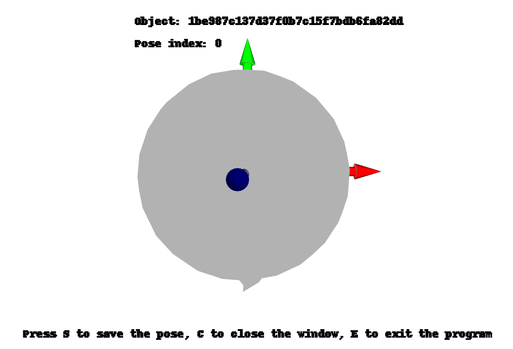

# Stable-PushNet


# Setup
## Install ROS
Tested on ros-noetic versions. [ROS Install](http://wiki.ros.org/noetic/Installation/Ubuntu)

## Install Isaac Gym
Tested on Preview 4 version. [Isaac Gym Install](https://developer.nvidia.com/isaac-gym)

## Install Mesh Data
CAD dish data selected from open dataset.\
Downloaded folder should be within "**data**" folder.
[Mesh Install](https://o365skku-my.sharepoint.com/:u:/g/personal/erichong96_o365_skku_edu/EZK1HV0M1mpDnwd2bEymdiMBeunjeT6EaD68aq5RcjkvTw?e=Elv4Y1)


```
catkin_ws
└── src
    └── stable-pushnet-datagen
          ├── config
          ├── data
          └── scripts
              ├── assets
              └── utils

```
 
## Setup workspace
Make catkin workspace, clone git repo, and make 

```bash
# Make catkin workspace
mkdir -p ~/catkin_ws/src
cd ~/catkin_ws/src

# Clone git repo
git clone https://github.com/Hongyoungjin/stable-pushnet-datagen.git

# Catkin workspace
cd ..
catkin_ws
cd src
```

## Python Dependencies
#### Python Packages
```bash
pip install -r requirements.txt
```
#### Pytorch
For safety, install Pytorch with the following command
```bash
pip3 install torch torchvision torchaudio
```
# Make Simulation Assets

You can also directly download the ready-made asset data from [this link](https://o365skku-my.sharepoint.com/:u:/g/personal/erichong96_o365_skku_edu/EWDsdDwv4btEso9qPhLnTP4BUOpUFKCcOEURE5EICDRaiA?e=oCCUyc).

[Initial Usage]
1. Open mesh_to_urdf.bash
2. root_dir="/path/to/dish_mesh_folder"
3. mesh_exts="(List up all mesh extensions)". 
  
### 1. Generate Isaac Gym Assets

Convert dish mesh to dish URDF.
Isaac Gym requires dish URDF for simulation.


```bash
cd ~/catkin_ws/src/scripts
source mesh_to_urdf.bash
```

### 2. Select Stable Dish Pose

Among multiple stable poses per dish, select the desired pose. \
Press **S** to select the pose, **C** to move on, and **E** to exit. \
Once chosen, all other poses will be deleted.

```bash
cd ~/catkin_ws/src/scripts
python3 select_stable_pose.py
```
<div align="center">

(x,y,z) <-> (r,g,b)
</div>

### 3. Augment Assets

Augment asset data through rescaling in x, y, and z axes.

```bash
cd ~/catkin_ws/src/scripts
# num: Number of new assets to be created per each asset.
python3 augment_asset_data.py --num 10
```

# Generate Synthetic Dataset

Types of dataset are as follows:
- Image: Top-view depth image of the dish
- Masked Image: Masked top-view depth image of the dish
- Velocity: SE(2) push direction
- Label: Whether the given push is successful or not (1 and 0)

### 1. Run Simulation 

```bash
cd ~/catkin_ws/src/scripts
source datagen_multiprocess.bash
```

### 2. Augment Train Dataset 

```bash
cd ~/catkin_ws/src/scripts
python3 augment_train_data.py
```

### 3. Analyze Train Data

Derive mean and standard variation values from train data. \
This is used to regulate the input data when deploying the trained model.

```bash
cd ~/catkin_ws/src/scripts
source data_stats.bash
```